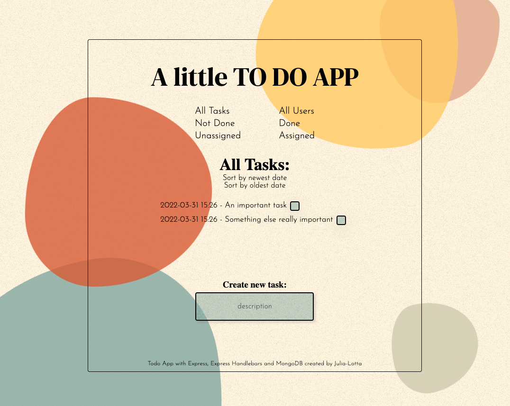

# Medieinstitutet Dynamic Web Development: Node JS To do app
Individual assignment at Medieinstitutet to create a Task Management App ☑ with Express & Handlebars.

## Installation
1. Clone the repo\
`git clone https://github.com/julialotta/MI-NODEJS-TodoApp.git`

2. Install npm packages\
`npm install`

3. Create a .env\
To run this application you need the following two things in a .env file:\
`CONNECTION_STRING="[Your mongoDB connectionstring]`

4. Run Nodemon\
`nodemon`

Visit localhost:8000 to view the project

## Built with
- HTML & CSS
- JavaScript
- Node.js
- Mongoose
- Express.js
- Handlebars

## Details
The assignment requirements was:
- Create a TODO application with Express and Handlebars.
- All Todo tasks should have the following attributes:
  - Id
  - Created (date & time)
  - Description
  - Done
- User should be able to perform all the CRUD operations (Create, Read, Update & Delete) on the tasks.

- User can chose to show all tasks, only done tasks (done=true) or not done tasks (done=false).
- User can sort tasks after creation date, both newest → oldest and oldest → newest.

## Contributors
[Julia-Lotta Tinglöf](https://github.com/julialotta)  
